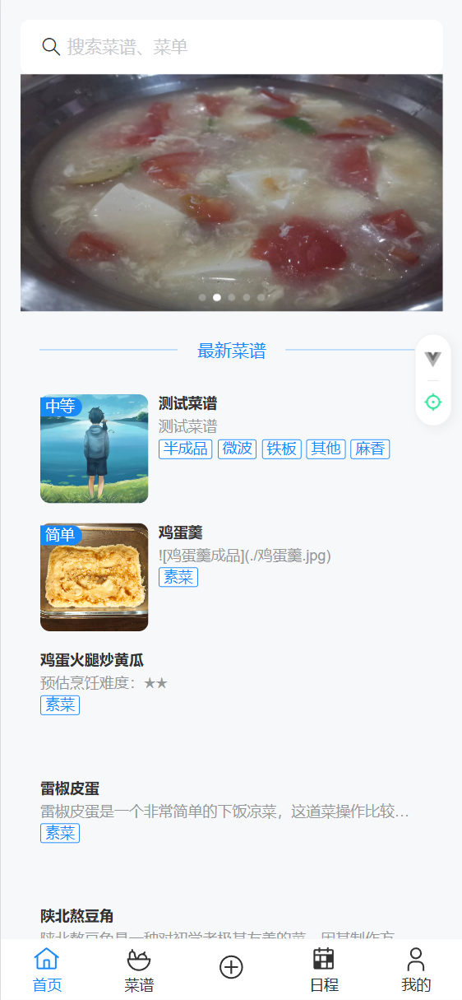
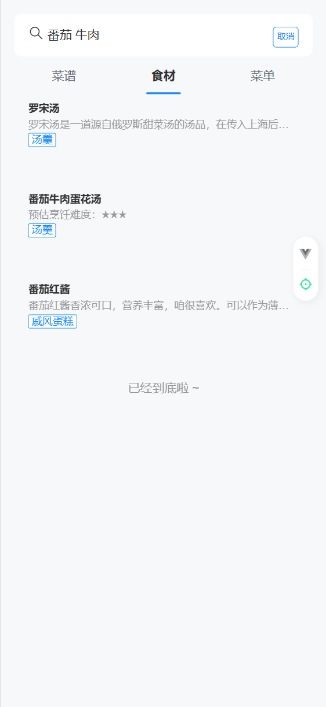
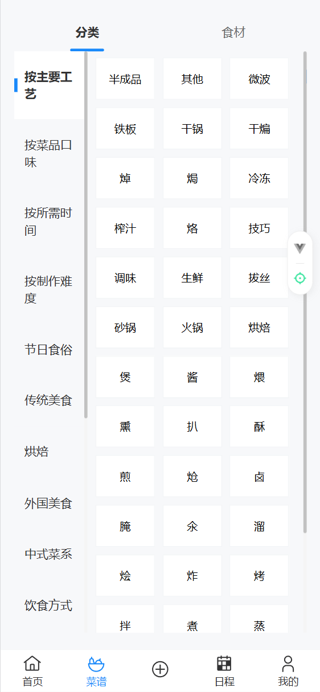
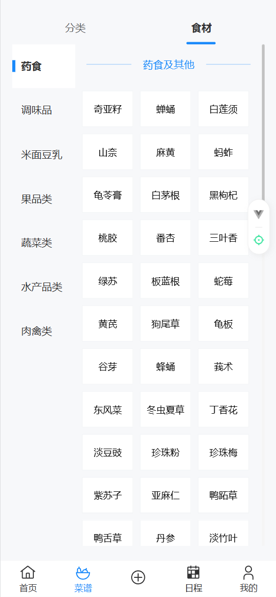
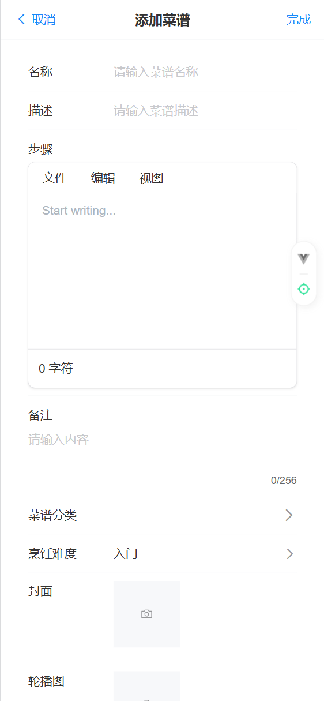
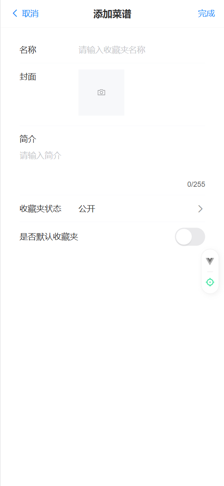
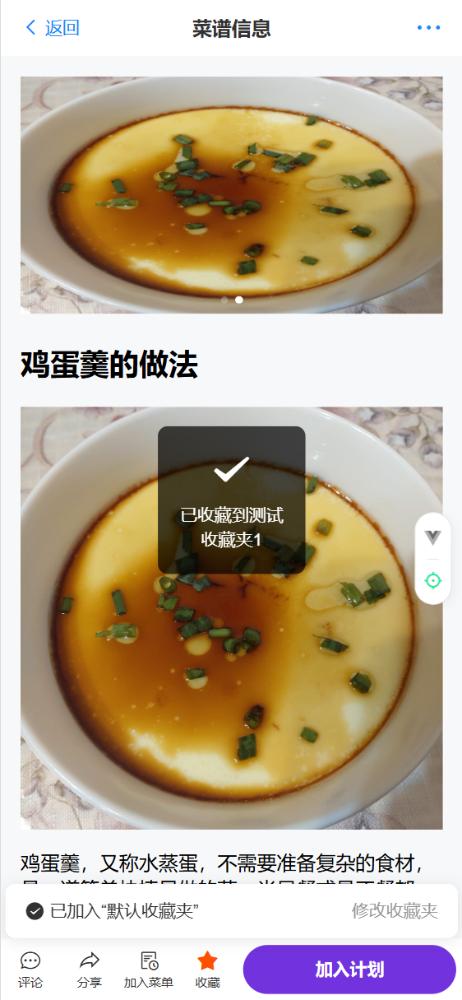
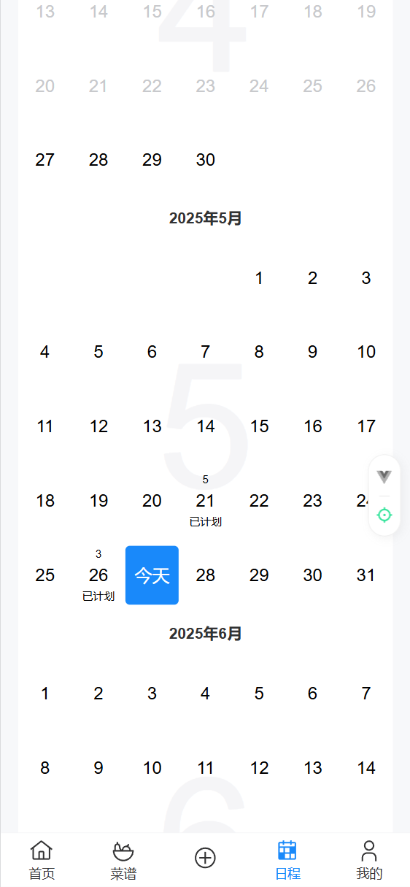

<div id="top" align="center">
<h1 align="center">每日饭菜</h1>
</div>

## 项目简介

用于录入菜谱信息并快速规划每日的饭菜计划，目前处于基础构建中，bug较多。

<p>


</p>
后台页面移步至[每日饭菜管理后台前端](https://github.com/insectmk/daily-meals-ui)

后端移步至[每日饭菜后端](https://github.com/insectmk/daily-meals)

## 部分页面展示

### 主页

<table>
<tr>
<td>

</td>
<td>

</td>
</tr>
</table>

### 分类

<table>
<tr>
<td>

</td>
<td>

</td>
</tr>
</table>

### 表单

<table>
<tr>
<td>

</td>
<td>

</td>
</tr>
</table>

### 菜谱

<table>
<tr>
<td>

</td>
<td>

</td>
</tr>
</table>

## 预配置

### UI 框架

- [UnoCSS](https://github.com/antfu/unocss) - 高性能且极具灵活性的即时原子化 CSS 引擎
  - [`@unocss/preset-rem-to-px`](https://github.com/unocss/unocss/tree/main/packages/preset-rem-to-px) - 将所有实用程序的 rem 转换为 px
  - [`eslint-plugin-unocss`](https://github.com/devunt/eslint-plugin-unocss) - Unocss 的 ESLint 插件
- [Vant](https://github.com/youzan/vant) - 移动端 Vue 组件库
  - [`vant-touch-emulator`](https://github.com/youzan/vant/tree/main/packages/vant-touch-emulator) - 在桌面端上模拟移动端 touch 事件
  - [`vant-use`](https://github.com/youzan/vant/tree/main/packages/vant-use) - Vant 内置的组合式 API

### 插件

- [Vue Router](https://github.com/vuejs/router)
  - [`unplugin-vue-router`](https://github.com/posva/unplugin-vue-router) - 以文件系统为基础的路由
- [Pinia](https://pinia.vuejs.org) - 直接的, 类型安全的, 使用 Composition API 的轻便灵活的 Vue 状态管理库
  - [`pinia-plugin-persistedstate`](https://github.com/prazdevs/pinia-plugin-persistedstate) -  适用于 Pinia 的持久化存储插件
- [Vue I18n](https://github.com/intlify/vue-i18n-next) - 国际化
  - [`unplugin-vue-i18n`](https://github.com/intlify/bundle-tools/tree/main/packages/unplugin-vue-i18n) - Vue I18n 的 Vite 插件
- [unplugin-vue-components](https://github.com/antfu/unplugin-vue-components) - 自动加载组件
- [unplugin-auto-import](https://github.com/antfu/unplugin-auto-import) - 直接使用 Composition API 等，无需导入
- [vite-plugin-vconsole](https://github.com/vadxq/vite-plugin-vconsole) - vConsole 的 vite 插件
- [vite-plugin-mock-dev-server](https://github.com/pengzhanbo/vite-plugin-mock-dev-server) - vite mock 开发服务（mock-dev-server）插件
- [postcss-mobile-forever](https://github.com/wswmsword/postcss-mobile-forever) - 一款 PostCSS 插件，将固定尺寸的移动端视图转为具有最大宽度的可伸缩的移动端视图
- [vite-plugin-vue-devtools](https://github.com/vuejs/devtools-next) - 旨在增强Vue开发者体验的Vite插件
- [vueuse](https://github.com/antfu/vueuse) - 实用的 Composition API 工具合集
- [@unhead/vue](https://github.com/unjs/unhead) - 响应式地操作文档头信息
- [vite-plugin-pwa](https://github.com/antfu/vite-plugin-pwa) - PWA
- [vite-plugin-sitemap](https://github.com/jbaubree/vite-plugin-sitemap) - sitemap 和 robots 生成器
- [echo-editor](https://github.com/Seedsa/echo-editor) - 支持移动端的富文本编辑器

### 编码风格

- 使用 Composition API 地 [`<script setup>` SFC 语法](https://github.com/vuejs/rfcs/pull/227)
- [ESLint](https://eslint.org/) 配置为 [@antfu/eslint-config](https://github.com/antfu/eslint-config), 单引号, 无分号

### 开发工具

- [TypeScript](https://www.typescriptlang.org/)
- [Vitest](https://github.com/vitest-dev/vitest) - 基于 Vite 的单元测试框架
- [pnpm](https://pnpm.js.org/) - 快, 节省磁盘空间的包管理器
- [Netlify](https://www.netlify.com/) - 零配置的部署
- [VS Code Extensions](./.vscode/extensions.json)
  - [Volar](https://marketplace.visualstudio.com/items?itemName=Vue.volar) - Vue 3 `<script setup>` IDE 支持
  - [Unocss](https://marketplace.visualstudio.com/items?itemName=antfu.unocss) - Unocss 智能提示
  - [Goto Alias](https://marketplace.visualstudio.com/items?itemName=antfu.goto-alias) - 跳转到定义
  - [Iconify IntelliSense](https://marketplace.visualstudio.com/items?itemName=antfu.iconify) - 图标内联显示和自动补全
  - [File Nesting](https://marketplace.visualstudio.com/items?itemName=antfu.file-nesting) - 文件嵌套
  - [i18n Ally](https://marketplace.visualstudio.com/items?itemName=lokalise.i18n-ally) - 多合一的 I18n 支持
  - [ESLint](https://marketplace.visualstudio.com/items?itemName=dbaeumer.vscode-eslint) - ESLint 支持
  - [Better JSON5](https://marketplace.visualstudio.com/items?itemName=blueglassblock.better-json5) - JSON5 支持

## 使用

该项目使用[使用easy-temps模板创建仓库](https://github.com/easy-temps/vue3-vant-mobile/generate)，需要 Node 版本 18+

### 开发

只需要执行以下命令就可以在 <http://localhost:62403> 中看到

```bash
pnpm dev
```

### 构建

构建该应用只需要执行以下命令

```bash
pnpm build
```

然后你会看到用于发布的 `dist` 文件夹被生成。

### 部署到 Netlify

前往 [Netlify](https://app.netlify.com/start) 并选择你的仓库, 一路 `OK` 下去，稍等一下后，你的应用将被创建。

## 社区 👏

推荐使用 [议题](https://github.com/insectmk/daily-meals-h5/issues) 来反馈问题。

## License

[MIT](./LICENSE) License

<p align="right">
  <a href="#top">⬆️ 回到顶部</a>
</p>
